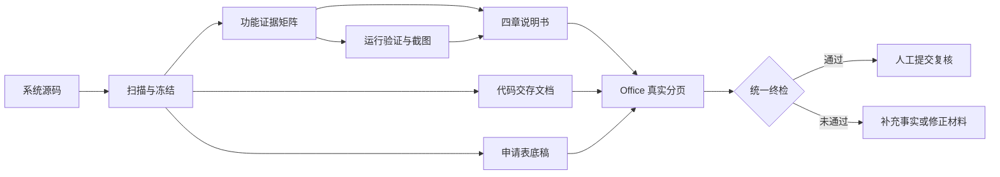

<div align="center">

# 📚 Software Copyright Material Generator Skill

### 从系统源码出发，生成并审计中国软件著作权登记“三件套”

[](SKILL.md)
[](requirements.txt)
[](LICENSE)
[](#环境要求)

**源码扫描 · 功能证据 · 界面截图 · 四章说明书 · 申请表底稿 · 代码交存 · 一致性终检**

[快速开始](#快速开始) · [核心能力](#核心能力) · [工作流程](#完整工作流程) · [质量门禁](#质量门禁) · [使用边界](#使用边界)

</div>

---

## 项目简介

`software-copyright-material-generator-skill` 是一个面向 Codex 的中国软件著作权材料生成与审计 Skill，也可以作为独立脚本工具集使用。它从已有软件源码中提取可验证事实，建立功能与代码证据之间的对应关系，并协助生成以下三类常用材料：

1. 软件设计与使用说明书；
2. 软件著作权登记申请表底稿；
3. 源程序一般交存文档。

本项目关注的不只是“生成 Word 文件”，而是让三份材料尽可能来自同一个事实源，并保留可复核的证据链、源代码快照与分页记录。软件名称、版本、程序量、功能描述和运行环境会被统一检查；申请人、著作权人、完成日期、权利范围等法律事实不会根据源码擅自推断。

> [!IMPORTANT]
> 本项目用于材料整理、技术审计和提交前复核，不构成法律意见、权属证明或登记结果承诺。正式提交前，请以办理当日的官方平台、登记机构和受理窗口要求为准。

## 为什么需要它

软著材料最容易出问题的地方，往往不是排版，而是三份文件相互矛盾：说明书写了代码没有实现的功能，申请表程序量与实际源码不一致，截图残留旧系统名称，代码不足时通过复制内容凑页，或者 Word 缓存页数与真实渲染页数不同。

本项目把这些风险转换为可执行、可复现的工作流：先冻结第一方源码，再建立功能证据矩阵和截图清单，随后生成三份 DOCX，最后结合 Word/WPS、PDF 和 DOCX 包级检查输出 `submission_ready` 结论。



## 核心能力

| 模块 | 能力 | 主要输出 |
|---|---|---|
| 🔍 源码扫描 | 排除依赖、构建产物、缓存、媒体、旧材料和数据库等非交存内容 | `project_facts.json`、`source_manifest.json` |
| 🧾 快照固化 | 记录文件顺序、编码、SHA-256、物理行数、非空行数和整包哈希 | 可复现的源代码清单 |
| 🧩 功能取证 | 按 0—4 级划分设计描述、数据结构、后端能力、完整调用链和运行截图 | `feature_evidence.json` |
| 🖼️ 图像处理 | 记录真实界面截图来源，并生成黑白架构图和流程图 | `figures_manifest.json`、PNG 图片 |
| 📖 说明书生成 | 生成设计说明、使用说明、运行环境、知识产权声明四章结构 | 说明书 DOCX |
| 📝 申请表生成 | 从统一配置填写可验证技术事实，未知法律字段留空并报告 | 申请表 DOCX、字段报告 |
| 💻 代码交存 | 小于等于 3000 行全量交存；超过 3000 行取前后各 1500 行 | 代码 DOCX、交存 provenance |
| 🧬 相似度审计 | 检查内部重复，并与用户提供的旧代码、DOCX 或 manifest 比较 | 相似度报告 |
| 📄 真实分页 | 使用 WPS Writer 或 Microsoft Word 更新域、重新分页并导出 PDF | 分页后的 DOCX、PDF |
| ✅ 统一终检 | 检查名称、版本、程序量、截图、证据、页数、元数据与跨材料一致性 | `qa_report.json`、`qa_report.md` |

## 三份材料

### 1. 软件设计与使用说明书

说明书默认采用完整四章结构：

- `1 软件设计说明`
- `2 软件使用说明`
- `3 软硬件运行环境`
- `4 知识产权声明`

正文采用适合软著材料的黑白排版，中文正文使用宋体，各级标题使用黑体，英文和数字使用 Times New Roman。核心功能应有真实运行截图支撑；架构图和流程图必须根据当前项目证据重新绘制，不能复用其他系统的图。

### 2. 软件著作权登记申请表底稿

申请表会尽量填写能够从源码、构建配置、运行验证和既有材料中确认的技术字段。身份、证件、地址、联系人、权属、完成日期、发表情况和签章等无法合法推断的事实保持空白，并进入人工补充清单。

### 3. 源程序一般交存文档

默认按常见的一般交存基线处理：

| 冻结源码非空行数 | 处理方式 |
|---:|---|
| 少于 3000 行 | 全量交存，不复制、不循环、不填充 |
| 等于 3000 行 | 全量交存 |
| 多于 3000 行 | 冻结顺序的前 1500 行与后 1500 行 |

默认目标为每页 50 个源码段落、前后各 30 页。最终页数必须由 Word/WPS 的真实排版结果和 PDF 复核确认，不能只依赖 `python-docx` 或 DOCX 缓存页数。

## 仓库结构

```text
software-copyright-material-generator-skill/
├─ SKILL.md
├─ README.md
├─ requirements.txt
├─ LICENSE
├─ agents/
│  └─ openai.yaml
├─ assets/
│  └─ application-form-template.docx
├─ references/
│  ├─ application-template-map.json
│  ├─ config-schema.md
│  ├─ evidence-and-writing-rules.md
│  ├─ material-details.md
│  └─ qa-gates.md
└─ scripts/
   ├─ scan_project.py
   ├─ render_diagrams.py
   ├─ build_manual.py
   ├─ build_application_form.py
   ├─ build_code_deposit.py
   ├─ audit_similarity.py
   ├─ refresh_office.ps1
   ├─ finalize_docx.py
   └─ audit_materials.py
```

## 环境要求

### 基础环境

- Python 3.10 或更高版本；
- `python-docx`、Pillow、lxml、PyMuPDF；
- 能够读取待处理源码的本地环境。

### 完整分页与终检

- Windows；
- WPS Writer 或 Microsoft Word；
- Office 软件支持 COM 自动化。

没有 Office 时仍可生成 DOCX 初稿和图片，但无法完成真实分页门禁，不应把结果标记为可提交。

## 快速开始

### 方式一：作为 Codex Skill 使用

克隆仓库：

```bash
git clone https://github.com/neuralsun/software-copyright-material-generator-skill.git
```

将仓库目录放入 Codex Skills 目录，文件夹名称保持为：

```text
software-copyright-material-generator-skill
```

调用示例：

```text
使用 $software-copyright-material-generator-skill 分析当前系统源码，生成软著说明书、申请表底稿和一般交存代码，并完成跨材料一致性检查。输出到指定目录，不要猜写申请人和权利信息。
```

### 方式二：作为脚本工具集使用

```bash
git clone https://github.com/neuralsun/software-copyright-material-generator-skill.git
cd software-copyright-material-generator-skill
python -m venv .venv
```

Windows PowerShell：

```powershell
.\.venv\Scripts\Activate.ps1
python -m pip install --upgrade pip
python -m pip install -r requirements.txt
```

Linux/macOS：

```bash
source .venv/bin/activate
python -m pip install --upgrade pip
python -m pip install -r requirements.txt
```

Linux/macOS 可以执行源码扫描、图片生成和 DOCX 初稿生成，但 `refresh_office.ps1` 仅适用于 Windows。

## 完整工作流程

建议优先让 Codex 按 [SKILL.md](SKILL.md) 执行完整流程。以下命令用于理解、复现和手动调试。

### 第一步：准备唯一事实源

创建 `kit_config.json`，集中维护软件全称、登记版本、完成日期、运行环境、程序量和权利字段。完整字段定义参见 [配置与中间文件规范](references/config-schema.md)。

> [!CAUTION]
> 著作权人、证件、地址、联系人、完成日期、开发方式、权利范围和发表情况必须来自用户确认或正式材料，不得由程序猜写。

### 第二步：扫描并冻结源码

```powershell
python scripts/scan_project.py `
  --project "D:\path\to\source" `
  --config "copyright-work\kit_config.json" `
  --output "copyright-work\project_facts.json" `
  --manifest "copyright-work\source_manifest.json"
```

冻结后不要继续修改源码。任何文件变化都应重新扫描，并重建下游材料。

### 第三步：建立功能证据与图片清单

阅读界面、路由/API、业务服务、数据访问和外部调用，编制 `feature_evidence.json`。证据等级 3 及以上的功能可以作为已实现功能写入说明书；等级 4 还必须包含隔离运行验证和经复核的真实截图。

```powershell
python scripts/render_diagrams.py `
  --input "copyright-work\diagrams.json" `
  --output-dir "copyright-work\figures"
```

### 第四步：生成三份 DOCX

生成说明书：

```powershell
python scripts/build_manual.py `
  --input "copyright-work\manual_content.json" `
  --output "copyright-work\<软件全称>_软件设计与使用说明书.docx"
```

生成申请表底稿：

```powershell
python scripts/build_application_form.py `
  --config "copyright-work\kit_config.json" `
  --template "assets\application-form-template.docx" `
  --output "copyright-work\<软件全称>_软件著作权登记申请表.docx" `
  --report "copyright-work\application_report.json" `
  --require-ready
```

先对代码交存执行 dry-run：

```powershell
python scripts/build_code_deposit.py `
  --manifest "copyright-work\deposit_config.json" `
  --dry-run `
  --report "copyright-work\code_audit.json" `
  --provenance "copyright-work\deposit_manifest.json"
```

确认没有阻断项后生成代码文档：

```powershell
python scripts/build_code_deposit.py `
  --manifest "copyright-work\deposit_config.json" `
  --output "copyright-work\<软件全称>-代码(一般交存版).docx" `
  --report "copyright-work\code_audit.json" `
  --provenance "copyright-work\deposit_manifest.json"
```

### 第五步：Office 真实分页

```powershell
Set-ExecutionPolicy -Scope Process -ExecutionPolicy Bypass

& scripts/refresh_office.ps1 `
  -Paths @(
    "copyright-work\<软件全称>_软件设计与使用说明书.docx",
    "copyright-work\<软件全称>_软件著作权登记申请表.docx",
    "copyright-work\<软件全称>-代码(一般交存版).docx"
  ) `
  -PdfDir "copyright-work\previews" `
  -Office Auto
```

逐页检查目录、标题、截图、表格、代码换行和页码后，使用 `finalize_docx.py` 写入实测页数。

### 第六步：执行统一终检

```powershell
python scripts/audit_materials.py `
  --config "copyright-work\kit_config.json" `
  --facts "copyright-work\project_facts.json" `
  --manifest "copyright-work\source_manifest.json" `
  --deposit-manifest "copyright-work\deposit_manifest.json" `
  --evidence "copyright-work\feature_evidence.json" `
  --figures "copyright-work\figures_manifest.json" `
  --manual-content "copyright-work\manual_content.json" `
  --manual "copyright-work\<软件全称>_软件设计与使用说明书.docx" `
  --application "copyright-work\<软件全称>_软件著作权登记申请表.docx" `
  --code "copyright-work\<软件全称>-代码(一般交存版).docx" `
  --pdf-dir "copyright-work\previews" `
  --report-json "copyright-work\qa_report.json" `
  --report-md "copyright-work\qa_report.md"
```

只有终检结果满足下列条件时，才能表述为“可进入人工提交复核”：

```json
{
  "submission_ready": true,
  "errors": []
}
```

## 功能证据等级

| 等级 | 典型证据 | 材料中允许的表述 |
|---:|---|---|
| 0 | 只有名称、注释、README 或依赖 | 不申报 |
| 1 | 只有模型、表、Schema、种子或未调用函数 | 通常不写，最多说明预留结构 |
| 2 | 后端函数或 API 存在，但用户路径不完整 | 谨慎说明内部能力及限制 |
| 3 | 交互入口、调用边界、业务处理和结果链完整 | 可写为已实现功能 |
| 4 | 3 级证据 + 隔离运行验证 + 真实截图 | 可作为说明书核心操作功能 |

非 Web 项目可以通过 `required_layers` 声明真实调用层，例如桌面应用使用 `ui + domain`，服务库使用 `api + domain`。不要为了通过检查而虚构不存在的 UI 或 HTTP API。

## 质量门禁

以下问题会阻断“可提交”状态：

- 软件全称、版本、完成日期或权利事实尚未确认；
- 申请人、著作权人、联系人或签章字段缺失；
- 源码冻结后发生变化，或存在多个冲突版本；
- 交存内容混入依赖、构建产物、缓存或生成代码；
- 源码或材料包含乱码、密钥、默认密码、令牌或固定邀请码；
- 源码不足 3000 行时通过复制内容凑成 60 页；
- 说明书声称的功能缺少完整代码证据；
- 核心功能未运行验证，或缺少经复核的真实截图；
- 截图含旧名称、个人信息、磁盘路径、错误堆栈或拼接痕迹；
- 说明书不是固定四章结构，或正文出现非黑色文字；
- Word/WPS 未完成真实分页，或 PDF 与 DOCX 页数不一致。

完整门禁清单参见 [三件套终检门禁](references/qa-gates.md)。

## 参考文档

| 文档 | 内容 |
|---|---|
| [SKILL.md](SKILL.md) | Codex 执行入口与完整工作流 |
| [config-schema.md](references/config-schema.md) | 配置文件和中间文件结构 |
| [evidence-and-writing-rules.md](references/evidence-and-writing-rules.md) | 功能证据、运行验证与写作规则 |
| [material-details.md](references/material-details.md) | 三份材料的内容与版式细节 |
| [qa-gates.md](references/qa-gates.md) | 跨材料一致性和提交前门禁 |

## 隐私与安全

- 不要把真实身份证、手机号、病历、订单、住址、人脸或账户信息放入截图和示例配置；
- 不要在 issue、日志、QA 报告或测试夹具中提交 API Key、数据库连接串、密码或令牌；
- 应在隔离数据库和本地回环地址中运行目标系统，避免调用生产支付、短信、邮件或外部业务接口；
- 报告只记录敏感值类型和位置，具体值应显示为 `<redacted>`；
- 上传源码或生成材料前，应重新执行仓库级 secret scan 和个人信息检查。

## 使用边界

- 内置申请表是通用填报底稿，不保证永久匹配未来的官方在线表单；
- 当前申请表生成器主要面向原创软件、一般交存和最多两名原始著作权人；
- 图片像素检查不能自动证明截图真实来自目标系统，仍需人工或 OCR 复核；
- 功能证据脚本能够验证路径、层级和行号，但不能完全替代业务语义审查；
- 本地相似度检查只能覆盖用户提供的材料，无法访问登记机构或第三方未知代码库；
- 自动检查通过不代表权属、证件、签章和申请事实已经获得法律确认。

## 参与贡献

欢迎提交能够提高可复现性、材料一致性和风险识别准确度的改进。提交 Pull Request 前请确保：

1. 不上传真实申请材料、证照、凭据和个人信息；
2. 为规则变更提供匿名化的最小测试样例；
3. 说明对说明书、申请表、代码交存或 QA 门禁的影响；
4. 通过 Python 语法检查、Ruff 和 Skill 结构校验；
5. 不加入绕过名称、版本、敏感值或相似度检查的逻辑。

## 许可证

本项目采用 [MIT License](LICENSE)。使用、修改和分发时请保留许可证与版权声明。

## 免责声明

本项目及其生成物仅用于材料整理、技术审计和提交前复核，不构成法律意见、权属证明或行政结果承诺。软著登记规则、平台字段、签章方式和鉴别材料要求可能变化，使用者应自行核对官方信息，并对提交内容的真实性、完整性和合法性负责。

---

<div align="center">

如果这个项目对你有帮助，欢迎 Star ⭐ 或提交改进建议。

</div>
